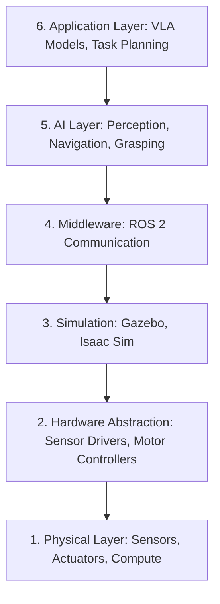

# Introduction to Physical AI

## The Evolution from Digital to Embodied Intelligence

For decades, artificial intelligence operated exclusively in the digital realm—analyzing text, recognizing images, playing games. But a fundamental shift is underway: **AI is gaining a body**.

Physical AI represents the convergence of three transformative technologies:

1. **Advanced AI Models**: Large Language Models (LLMs), vision transformers, and reinforcement learning agents
2. **High-Fidelity Simulation**: Physics engines (Gazebo, Isaac Sim) that replicate real-world dynamics
3. **Robotic Platforms**: Sensors, actuators, and computing hardware that bridge bits and atoms

This course focuses on **humanoid robotics** as the ultimate testbed for Physical AI because humanoid form factors must solve the same challenges humans face—walking on uneven terrain, manipulating diverse objects, navigating cluttered environments.

---

## What Makes Physical AI Different?

Traditional AI systems process static inputs and produce digital outputs:

```python
# Digital AI: Text input → Text output
response = llm.generate("Explain quantum entanglement")
print(response)  # Digital text rendered on screen
```

Physical AI systems interact with the real world through **perception-action loops**:

```python
# Physical AI: Sensor input → Physical action
lidar_scan = robot.get_lidar_data()  # Perception
obstacles = detect_obstacles(lidar_scan)  # Cognition
robot.navigate_around(obstacles)  # Action
```

This introduces challenges absent in digital AI:

- **Uncertainty**: Sensor noise, lighting variations, occlusions
- **Dynamics**: Physics, inertia, friction, contact forces
- **Real-Time Constraints**: Control loops running at 50-1000 Hz
- **Safety**: A misclassification can cause physical harm
- **Irreversibility**: You can't "undo" a robot dropping a fragile object

---

## The Humanoid Robotics Landscape

The past five years have seen explosive growth in general-purpose humanoid robots:

### **Industry Leaders**

| Company              | Robot           | Key Innovation                                  | Status                  |
| -------------------- | --------------- | ----------------------------------------------- | ----------------------- |
| **Boston Dynamics**  | Atlas           | Hydraulic actuators, parkour capabilities       | Research (not for sale) |
| **Tesla**            | Optimus (Gen 2) | Mass manufacturing at scale, $20K target price  | Development             |
| **Figure**           | Figure 01       | Full-body teleoperation, OpenAI VLA integration | Pilot deployments       |
| **Agility Robotics** | Digit           | Commercial warehouse deployment                 | Production              |
| **Sanctuary AI**     | Phoenix         | Human-like hands (20 DOF per hand)              | Beta testing            |
| **1X Technologies**  | NEO             | Biomimetic musculature, safe human interaction  | Development             |

### **Why Humanoid Form Factor?**

Humanoid robots aren't just science fiction—they're pragmatic:

1. **Infrastructure Compatibility**: Our world is designed for human bodies (doorways, stairs, tools)
2. **Tool Reuse**: No need to redesign every tool—humanoids use existing hammers, screwdrivers, keyboards
3. **Social Acceptance**: Human-like appearance facilitates acceptance in elder care and service roles
4. **Unified Platform**: One robot for multiple tasks (cleaning, delivery, assembly) vs. specialized single-purpose robots

---

## The Physical AI Stack

Building a functional humanoid requires integrating six core layers:



### **Layer 1: Physical Hardware**

- **Sensors**: LiDAR (RPLIDAR A1), depth cameras (RealSense D435i), IMU (MPU-6050)
- **Actuators**: Servo motors (Dynamixel, MG996R), stepper motors
- **Compute**: NVIDIA Jetson Orin Nano, Raspberry Pi 4, Arduino Mega

### **Layer 2: Hardware Abstraction**

- Device drivers translating raw sensor data into standard formats
- Motor controllers accepting velocity/position commands

### **Layer 3: Simulation Environments**

- **Gazebo**: Open-source physics engine for prototyping
- **NVIDIA Isaac Sim**: Photorealistic rendering, GPU-accelerated physics, synthetic data generation

### **Layer 4: Middleware (ROS 2)**

- Publisher-subscriber communication for sensor data streaming
- Services for request-response patterns (e.g., path planning queries)
- Actions for long-running tasks with feedback (e.g., "grasp object")

### **Layer 5: AI Perception & Planning**

- **VSLAM** (Visual Simultaneous Localization and Mapping): Where am I?
- **Nav2**: How do I get there?
- **Object Detection**: What obstacles exist?
- **Grasping**: How do I manipulate this?

### **Layer 6: Vision-Language-Action (VLA)**

- Natural language understanding: "Bring me the red cup from the kitchen"
- Task decomposition: Navigate → Locate → Grasp → Return
- Execution monitoring and error recovery

---

## Course Roadmap: From Bits to Atoms

This course follows a **bottom-up progression**, building competency layer by layer:

### **Module 1: The Robotic Nervous System (ROS 2)**

**Weeks 1-4**

You'll master Robot Operating System 2 (ROS 2), the industry-standard middleware for robotics:

- **Communication Patterns**: Publishers, subscribers, services, actions
- **Robot Modeling**: URDF (Unified Robot Description Format) for humanoid kinematics
- **Integration**: Connecting sensors (LiDAR, cameras) to ROS 2 nodes

**Deliverable**: ROS 2 control system for a simulated humanoid with 20+ degrees of freedom

[Start Module 1 →](./module-1-ros2/index.mdx)

---

### **Module 2: Digital Twin Simulation**

**Weeks 5-7**

Before deploying to expensive hardware, you'll validate designs in physics-accurate simulations:

- **Gazebo Physics**: Gravity, friction, collisions, and contact dynamics
- **Sensor Simulation**: Virtual LiDAR, depth cameras, and IMU with realistic noise models
- **Unity Visualization**: High-fidelity rendering for presentations and debugging

**Deliverable**: Gazebo environment with humanoid navigating obstacles using simulated sensors

[Explore Module 2 →](./module-2-digital-twin/index.mdx)

---

### **Module 3: The AI-Robot Brain (NVIDIA Isaac)**

**Weeks 8-10**

NVIDIA Isaac ecosystem accelerates AI inference on embedded GPUs:

- **Isaac Sim**: Generate synthetic training datasets (millions of labeled images)
- **Isaac ROS**: Pre-built AI models for VSLAM, object detection, pose estimation
- **Nav2 for Bipedal Robots**: Adapt navigation stacks designed for wheeled robots

**Deliverable**: Visual SLAM pipeline running on NVIDIA Jetson hardware

[Dive into Module 3 →](./module-3-isaac/index.mdx)

---

### **Module 4: Vision-Language-Action (VLA)**

**Weeks 11-13**

The frontier of Physical AI: robots that understand natural language and execute complex tasks:

- **Voice Input**: OpenAI Whisper for speech-to-text
- **LLM Planning**: GPT-4 decomposes "Make me coffee" into executable steps
- **Action Execution**: Translate plans into ROS 2 actions with error recovery

**Deliverable**: Capstone project—autonomous humanoid responding to voice commands

[Master Module 4 →](./module-4-vla/index.mdx)

---

## Key Concepts You'll Master

### **1. Embodied Intelligence**

Unlike disembodied AI (ChatGPT, DALL-E), embodied systems must:

- Maintain **temporal coherence** (world state changes between actions)
- Handle **partial observability** (can't see behind obstacles)
- Reason about **physical constraints** (can't teleport, must conserve momentum)

### **2. Sim-to-Real Transfer**

Training robots in simulation is 1000x faster than real-world trials, but introduces the **reality gap**:

| Simulation         | Reality                          |
| ------------------ | -------------------------------- |
| Perfect physics    | Friction varies, parts degrade   |
| Noise-free sensors | Sensor drift, calibration errors |
| Infinite resets    | Hardware wear, safety risks      |

**Mitigation Strategies**:

- **Domain Randomization**: Vary lighting, textures, physics parameters in simulation
- **System Identification**: Measure real-world dynamics and tune simulator
- **Residual Learning**: Train policies that adapt to reality gap

### **3. Perception-Action Loops**

Physical AI operates in continuous feedback loops:

```python
while robot.is_active():
    # 1. Perceive
    sensor_data = robot.read_sensors()  # 100 Hz

    # 2. Process
    world_state = perception_model(sensor_data)

    # 3. Decide
    action = policy(world_state, goal)

    # 4. Act
    robot.execute(action)

    # 5. Wait (maintain control frequency)
    sleep(0.01)  # 100 Hz loop
```

Latency anywhere in this loop degrades performance—a 50ms delay in obstacle detection can cause collisions.

---

## Real-World Applications

Physical AI is transforming industries:

### **Manufacturing**

- **Tesla Gigafactory**: Optimus robots assembling battery packs
- **BMW**: Humanoids handling delicate wiring in tight spaces

### **Healthcare**

- **Diligent Robotics (Moxi)**: Autonomous hospital delivery robot
- **Intuitive Surgical (da Vinci)**: Surgical robots with haptic feedback

### **Logistics**

- **Agility Robotics (Digit)**: Unloading trucks in Amazon warehouses
- **Boston Dynamics (Stretch)**: Automated pallet handling

### **Space Exploration**

- **NASA Valkyrie**: Humanoid for Mars habitats (designed for human tools/environments)
- **GITAI**: Teleoperated robots for ISS maintenance

### **Eldercare**

- **SoftBank Pepper**: Companion robots in nursing homes
- **Toyota T-HR3**: Remote caregiving via teleoperation

---

## What You'll Need

### **Software (All Free)**

- **OS**: Ubuntu 22.04 LTS (native or WSL2 on Windows)
- **ROS 2**: Humble Hawksbill distribution
- **Simulation**: Gazebo Classic 11 or Gazebo Fortress
- **AI Tools**: Python 3.10+, PyTorch, OpenCV

### **Hardware Options**

1. **Simulation-Only** ($0): Complete course using cloud GPU (NVIDIA Omniverse, Google Colab)
2. **Minimal Setup** ($400): NVIDIA Jetson Orin Nano + RealSense camera
3. **Full Hardware** ($800-1200): Add LiDAR, servo motors, and build physical humanoid

[See detailed hardware guide →](./supporting/hardware-requirements.mdx)

---

## Learning Philosophy

This course is **project-driven**, not lecture-driven:

1. **Motivation First**: Every concept starts with "why does this matter?"
2. **Working Code**: No pseudocode—all examples are tested and runnable
3. **Incremental Complexity**: Start with "hello world" publisher, end with autonomous VLA system
4. **Debugging Skills**: Learn to diagnose sensor failures, network issues, and planning bugs
5. **Production Mindset**: Containerization (Docker), version control (Git), and testing from day one

---

## Success Metrics

You'll know you've succeeded when you can:

✅ **Debug a failing ROS 2 node** by inspecting topic traffic with `ros2 topic echo`

✅ **Explain the reality gap** and propose three mitigation strategies for sim-to-real transfer

✅ **Integrate a new sensor** (e.g., ultrasonic range finder) into an existing robot in under 2 hours

✅ **Evaluate VLA architectures** and articulate tradeoffs between end-to-end learned policies vs. modular systems

✅ **Deploy a robot** that responds to "Go to the kitchen and bring me the blue box"

---

## Community & Support

- **Discussion Forum**: [GitHub Discussions](#) (placeholder—link your actual forum)
- **Office Hours**: Weekly live Q&A sessions (check course schedule)
- **Collaboration**: Form study groups for capstone projects
- **Industry Connections**: Guest lectures from robotics engineers at Boston Dynamics, Tesla, Figure

---

## Let's Build the Future

Physical AI is not just an incremental improvement—it's a paradigm shift. The same way the internet connected information, Physical AI will connect intelligence to the physical world.

Whether you dream of building the next Atlas, deploying warehouse robots, or creating companions for elder care, this course provides the foundational skills and systems-thinking required to bring embodied intelligence to life.

**No more simulations. No more theory. Let's build robots that move, sense, and act.**

[Continue to Module 1: ROS 2 Fundamentals →](./module-1-ros2/index.mdx)
