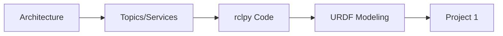

# Module 1: The Robotic Nervous System (ROS 2)

## Overview

Just as the human nervous system coordinates billions of neurons to produce coherent movement, Robot Operating System 2 (ROS 2) coordinates distributed software components to control complex robotic systems. This module teaches you the architectural patterns, communication primitives, and modeling techniques essential for building production-grade humanoid robots.

ROS 2 is the **industry standard** for robotics software—used by Boston Dynamics, NASA, Amazon Robotics, BMW, and Tesla. Unlike ROS 1 (designed for single-robot research), ROS 2 targets multi-robot systems, real-time control, and safety-critical applications.

---

## What You'll Learn

By the end of this module, you will:

- ✅ **Understand ROS 2 Architecture**: Master the DDS middleware layer, client libraries (rclpy/rclcpp), and computation graph
- ✅ **Build Communication Networks**: Create publishers, subscribers, services, and actions for sensor data flow and control
- ✅ **Integrate Real Sensors**: Connect LiDAR, cameras, and IMU to ROS 2 topics with proper message types
- ✅ **Model Humanoid Robots**: Write URDF descriptions for kinematic chains with 20+ degrees of freedom
- ✅ **Debug Distributed Systems**: Use ROS 2 CLI tools to inspect nodes, topics, and message flows

---

## Topics Covered

### [1. ROS 2 Architecture](./01-architecture.mdx)

Explore the layered architecture—from DDS middleware to client libraries—and understand how ROS 2 achieves real-time, deterministic communication.

**Key Concepts**: DDS, QoS policies, discovery protocol, computation graph

---

### [2. Nodes, Topics, Services, and Actions](./02-nodes-topics-services.mdx)

Master the four core communication patterns that coordinate robot subsystems.

**Key Concepts**: Publisher-subscriber, request-response, goal-based execution, feedback loops

---

### [3. rclpy Integration](./03-rclpy-integration.mdx)

Write Python-based ROS 2 nodes using the rclpy client library—from minimal examples to advanced lifecycle management.

**Key Concepts**: Node initialization, timer callbacks, parameter servers, logging

---

### [4. URDF for Humanoids](./04-urdf-humanoids.mdx)

Design robot descriptions using URDF/XACRO, defining joints, links, and kinematic chains for humanoid robots.

**Key Concepts**: URDF syntax, joint types (revolute, prismatic), collision meshes, Gazebo integration

---

## Prerequisites

Before starting this module:

- **Python 3.8+**: Familiarity with classes, decorators, and async programming
- **Linux Command Line**: Ability to navigate directories, edit files, and run shell commands
- **Basic Robotics Concepts**: Understanding of coordinate frames, sensors (cameras, LiDAR), and actuators (motors)

**Optional but Helpful**:

- Prior experience with ROS 1 (we'll highlight differences)
- C++ knowledge (for performance-critical nodes)
- Understanding of distributed systems

---

## Estimated Time

**6-8 hours** over 2 weeks

- **Reading**: 3 hours (architecture concepts, API documentation)
- **Hands-On Labs**: 4 hours (building publishers, subscribers, URDF models)
- **Project 1**: 2-3 hours (ROS 2 humanoid control system)

---

## Hardware Requirements

### **Option 1: Simulation Only** (Recommended for Module 1)

- Ubuntu 22.04 (native, VM, or WSL2)
- ROS 2 Humble installed
- Gazebo Classic 11
- No physical hardware needed

### **Option 2: Physical Sensors** (Optional Enhancement)

- RPLiDAR A1 ($99) or equivalent
- Intel RealSense D435i ($279)
- USB connections for sensor integration

---

## Real-World Context

### **Why ROS 2 Matters**

ROS 2 solves critical problems that plagued ROS 1:

| Challenge                 | ROS 1 Limitation                   | ROS 2 Solution                   |
| ------------------------- | ---------------------------------- | -------------------------------- |
| **Real-Time Control**     | No deterministic communication     | DDS middleware with QoS policies |
| **Multi-Robot Systems**   | Single roscore master (bottleneck) | Decentralized discovery          |
| **Security**              | No encryption, authentication      | DDS security plugins (SROS2)     |
| **Cross-Platform**        | Linux-only                         | Windows, macOS, RTOS support     |
| **Production Deployment** | Research-focused                   | Industry-grade reliability       |

### **Industry Adoption**

- **Boston Dynamics Atlas**: ROS 2 for sensor fusion and control loops
- **NASA Mars Rovers**: ROS 2 for autonomy stacks (Curiosity's successor)
- **Amazon Robotics**: Warehouse robots using ROS 2 Nav2
- **Tesla Optimus**: Internal reports suggest ROS 2-based development

---

## Learning Path

This module follows a **progressive complexity** approach:

1. **Conceptual Foundation** (Chapter 1): Understand the "why" before the "how"
2. **Communication Primitives** (Chapter 2): Learn the building blocks
3. **Implementation** (Chapter 3): Write working code
4. **Robot Modeling** (Chapter 4): Describe physical systems
5. **Integration Project**: Combine all concepts into a humanoid control system

---

## Key Takeaways

After completing this module, you'll understand:

- **When to Use Each Pattern**:
  - Topics: Streaming sensor data (LiDAR scans, camera images)
  - Services: One-off requests (path planning, inverse kinematics)
  - Actions: Long-running tasks (navigation to goal, grasping)

- **How ROS 2 Scales**:
  - Decentralized discovery enables 100+ node systems
  - QoS policies tune latency vs. reliability tradeoffs
  - Component-based composition reduces overhead

- **Debugging Strategies**:
  - `ros2 topic list` → Discover active topics
  - `ros2 topic echo /scan` → Inspect live data
  - `ros2 node info /my_node` → View node connections
  - `rqt_graph` → Visualize computation graph

---

## Common Pitfalls (and How to Avoid Them)

1. **QoS Mismatch**: Publishers and subscribers must have compatible QoS policies
   - **Fix**: Use `ros2 topic info /topic_name -v` to inspect QoS settings

2. **Callback Overload**: Processing in callbacks blocks other callbacks
   - **Fix**: Use multi-threaded executors or offload heavy computation

3. **Frame Confusion**: Coordinate transforms between robot_base, sensors, and world
   - **Fix**: Master `tf2` library (covered in Module 2)

4. **URDF Syntax Errors**: Small typos break visualization
   - **Fix**: Validate with `check_urdf my_robot.urdf`

---

## Project 1 Preview

At the end of this module, you'll build a **ROS 2 Humanoid Control System** featuring:

- **Architecture**: 5+ nodes (sensor publishers, motion planner, controller, visualizer)
- **URDF Model**: Humanoid with 20+ DOF (head, torso, arms, legs)
- **Simulation**: Gazebo environment with physics
- **Control**: Send velocity commands to make the robot walk

**Deliverables**:

- Source code (Python package)
- URDF file
- Demo video (2 minutes)

[View Project 1 requirements →](../supporting/assessments.mdx#project-1-ros-2-humanoid-control-system)

---

## Additional Resources

- **Official Docs**: [ROS 2 Humble Documentation](https://docs.ros.org/en/humble/)
- **Tutorials**: [ROS 2 Tutorials](https://docs.ros.org/en/humble/Tutorials.html)
- **Community**: [ROS Discourse](https://discourse.ros.org/)
- **Source Code**: [ROS 2 GitHub](https://github.com/ros2)

---

## Next Steps

Ready to dive into the architecture? Let's start by understanding how ROS 2 achieves deterministic, real-time communication.

[Continue to ROS 2 Architecture →](./01-architecture.mdx)
