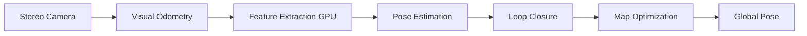

# Isaac ROS Visual SLAM

## What is VSLAM?

**Visual Simultaneous Localization and Mapping** answers two questions:

1. **Where am I?** (Localization)
2. **What does the world look like?** (Mapping)

Using only camera input—no LiDAR, GPS, or wheel odometry.

---

## Isaac ROS VSLAM Pipeline



**GPU Acceleration**: 10-100x faster than CPU-based ORB-SLAM3.

---

## Installation (NVIDIA Jetson Orin)

```bash
# Install Isaac ROS
sudo apt-get install -y ros-humble-isaac-ros-visual-slam

# Dependencies
sudo apt-get install -y \
  ros-humble-realsense2-camera \
  ros-humble-isaac-ros-common

# Verify GPU
nvidia-smi
# Should show: Jetson Orin Nano, CUDA 11.4+
```

---

## Launch Visual SLAM

### **With RealSense D435i**

```bash
# Terminal 1: Camera driver
ros2 launch realsense2_camera rs_launch.py \
  enable_infra1:=true \
  enable_infra2:=true \
  enable_depth:=true

# Terminal 2: Isaac ROS VSLAM
ros2 launch isaac_ros_visual_slam isaac_ros_visual_slam.launch.py
```

### **Configuration**

```python title="vslam_params.yaml"
/**:
  ros__parameters:
    # Camera intrinsics (RealSense D435i)
    image_width: 640
    image_height: 480
    fx: 383.21  # Focal length X
    fy: 383.21  # Focal length Y
    cx: 320.0   # Principal point X
    cy: 240.0   # Principal point Y

    # Stereo baseline (meters)
    baseline: 0.05

    # Feature extraction
    num_features: 1000
    enable_localization_n_mapping: true
    enable_loop_closure: true

    # Pose output
    map_frame: "map"
    odom_frame: "odom"
    base_frame: "base_link"
```

---

## Visualizing SLAM in RViz2

```bash
rviz2

# Add displays:
# 1. TF → Show map → odom → base_link transforms
# 2. PoseStamped → Topic: /visual_slam/tracking/odometry
# 3. PointCloud2 → Topic: /visual_slam/tracking/slam_points
# 4. Path → Topic: /visual_slam/tracking/slam_path
```

---

## Custom VSLAM Node

```python title="vslam_localizer.py" showLineNumbers
import rclpy
from rclpy.node import Node
from nav_msgs.msg import Odometry
from geometry_msgs.msg import PoseStamped
import numpy as np

class VSLAMLocalizer(Node):
    def __init__(self):
        super().__init__('vslam_localizer')

        # Subscribe to VSLAM output
        self.create_subscription(
            Odometry,
            '/visual_slam/tracking/odometry',
            self.odom_callback,
            10
        )

        # Publish filtered pose
        self.pose_pub = self.create_publisher(PoseStamped, '/robot/pose', 10)

        self.last_pose = None

    def odom_callback(self, msg):
        # Extract position
        pos = msg.pose.pose.position
        orient = msg.pose.pose.orientation

        # Check for tracking loss (large velocity)
        vel = msg.twist.twist.linear
        speed = np.sqrt(vel.x**2 + vel.y**2 + vel.z**2)

        if speed > 10.0:  # Unrealistic velocity
            self.get_logger().warn('VSLAM tracking lost! Using last known pose.')
            return

        # Publish pose
        pose_msg = PoseStamped()
        pose_msg.header = msg.header
        pose_msg.pose.position = pos
        pose_msg.pose.orientation = orient

        self.pose_pub.publish(pose_msg)
        self.last_pose = pose_msg

        self.get_logger().info(
            f'Position: ({pos.x:.2f}, {pos.y:.2f}, {pos.z:.2f})'
        )

def main(args=None):
    rclpy.init(args=args)
    node = VSLAMLocalizer()
    rclpy.spin(node)
    node.destroy_node()
    rclpy.shutdown()
```

---

## Loop Closure Detection

When robot revisits a location, VSLAM detects the loop and corrects accumulated drift.

```yaml
# Enable loop closure
enable_loop_closure: true
loop_closure_frequency: 0.5 # Check every 2 seconds
loop_closure_proximity_threshold: 3.0 # meters
```

**Visualization**:

```bash
ros2 topic echo /visual_slam/loop_closure_event

# Output when loop detected:
# loop_id: 42
# matched_frame_id: 17
# transform: [x, y, z, qx, qy, qz, qw]
```

---

## Saving and Loading Maps

```bash
# Save map during operation
ros2 service call /visual_slam/save_map \
  isaac_ros_visual_slam_interfaces/srv/FilePath \
  "{file_path: '/home/user/maps/warehouse.map'}"

# Load map on startup
ros2 param set /visual_slam map_file_path /home/user/maps/warehouse.map
```

---

## Troubleshooting

### **Issue: Tracking Loss**

**Symptoms**: Pose jumps, erratic odometry

**Solutions**:

1. **Improve lighting**: VSLAM needs textured environments
2. **Reduce motion blur**: Slower movements or faster shutter
3. **Increase features**: `num_features: 2000`

### **Issue: High Latency**

**Symptoms**: Delayed pose updates (>100ms)

**Solutions**:

1. **Reduce image resolution**: 640x480 → 320x240
2. **Disable loop closure**: `enable_loop_closure: false`
3. **Check GPU utilization**: `tegrastats` on Jetson

---

## Performance Benchmarks

| Platform             | FPS | Latency | Power |
| -------------------- | --- | ------- | ----- |
| **Jetson Orin Nano** | 30  | 33ms    | 15W   |
| **Jetson AGX Orin**  | 60  | 16ms    | 25W   |
| **RTX 3080**         | 120 | 8ms     | 320W  |

---

## Key Takeaways

✅ **GPU Acceleration**: 10-100x faster than CPU SLAM

✅ **Stereo Cameras**: More robust than monocular (scale ambiguity)

✅ **Loop Closure**: Corrects drift for long-duration missions

✅ **Real-Time**: Sub-50ms latency on Jetson Orin

---

## Next Steps

Use VSLAM pose estimates for navigation planning with Nav2.

[Continue to Nav2 for Bipedal Navigation →](./03-nav2-bipedal.mdx)
