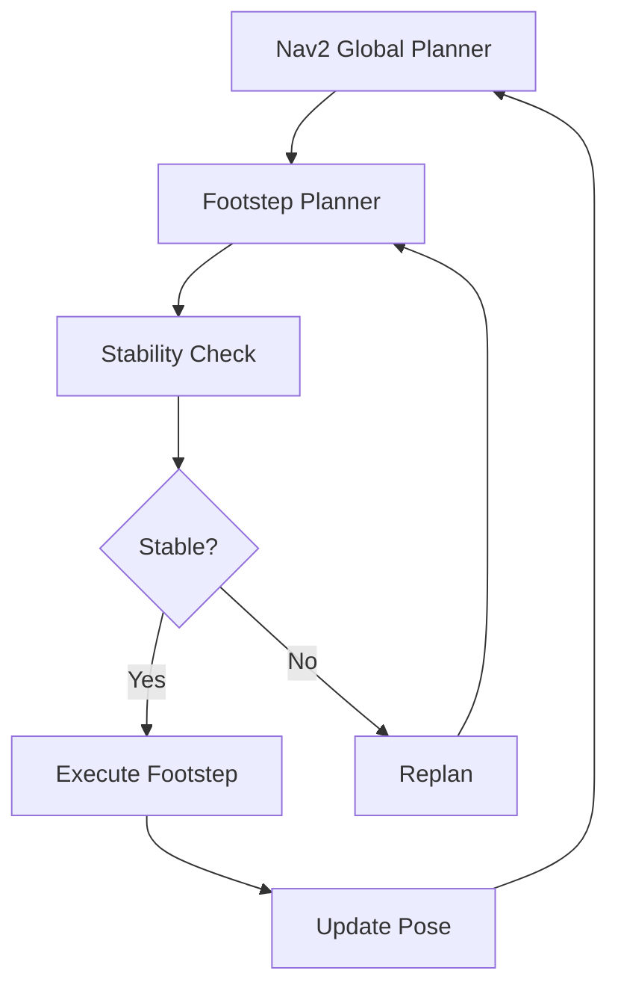

# Nav2 for Bipedal Humanoid Navigation

## Nav2 Overview

**Nav2** (Navigation2) is the ROS 2 successor to the move_base stack, providing:

- **Costmaps**: 2D occupancy grids representing obstacles
- **Planners**: Global (A\*, Dijkstra) and local (DWA, TEB) path planning
- **Controllers**: Velocity command generation to follow paths
- **Behavior Trees**: Hierarchical task execution (navigate, spin, backup)
- **Recovery Behaviors**: Handle stuck scenarios (rotate in place, clear costmap)

**Challenge**: Nav2 assumes **differential drive** (wheeled robots). Humanoids require **footstep planning** and **dynamic balance**.

---

## Adaptation Strategy



---

## Installation

```bash
sudo apt install ros-humble-navigation2 ros-humble-nav2-bringup
```

---

## Costmap Configuration

```yaml title="costmap_params.yaml" showLineNumbers
global_costmap:
  global_frame: map
  robot_base_frame: base_link
  update_frequency: 1.0
  publish_frequency: 1.0

  static_layer:
    plugin: 'nav2_costmap_2d::StaticLayer'
    map_subscribe_transient_local: true

  obstacle_layer:
    plugin: 'nav2_costmap_2d::ObstacleLayer'
    observation_sources: scan
    scan:
      topic: /scan
      data_type: 'LaserScan'
      marking: true
      clearing: true
      min_obstacle_height: 0.0
      max_obstacle_height: 2.0

  inflation_layer:
    plugin: 'nav2_costmap_2d::InflationLayer'
    inflation_radius: 0.5 # Wider for humanoid body
    cost_scaling_factor: 3.0

local_costmap:
  global_frame: odom
  robot_base_frame: base_link
  update_frequency: 5.0
  publish_frequency: 2.0
  width: 3
  height: 3
  resolution: 0.05
```

---

## Footstep Planner

```python title="footstep_planner.py" showLineNumbers
import rclpy
from rclpy.node import Node
from geometry_msgs.msg import PoseStamped, Twist
from nav_msgs.msg import Path
import numpy as np

class FootstepPlanner(Node):
    def __init__(self):
        super().__init__('footstep_planner')

        # Subscribe to global path
        self.create_subscription(Path, '/plan', self.path_callback, 10)

        # Publish velocity commands
        self.cmd_pub = self.create_publisher(Twist, '/cmd_vel', 10)

        # Footstep parameters
        self.step_length = 0.3  # meters
        self.step_width = 0.2   # meters (lateral separation)
        self.step_duration = 0.8  # seconds

    def path_callback(self, msg):
        if not msg.poses:
            return

        # Extract target pose
        target = msg.poses[-1].pose.position

        # Compute footsteps
        footsteps = self.plan_footsteps(target)

        # Execute footsteps
        for step in footsteps:
            self.execute_step(step)

    def plan_footsteps(self, target):
        footsteps = []
        current_x, current_y = 0.0, 0.0  # Robot start position

        # Distance to target
        dx = target.x - current_x
        dy = target.y - current_y
        distance = np.sqrt(dx**2 + dy**2)

        # Number of steps
        num_steps = int(distance / self.step_length)

        # Generate alternating left/right steps
        for i in range(num_steps):
            foot = 'left' if i % 2 == 0 else 'right'
            lateral_offset = self.step_width / 2 if foot == 'left' else -self.step_width / 2

            step_x = current_x + (dx / distance) * self.step_length
            step_y = current_y + (dy / distance) * self.step_length + lateral_offset

            footsteps.append({'foot': foot, 'x': step_x, 'y': step_y})
            current_x, current_y = step_x, step_y

        return footsteps

    def execute_step(self, step):
        self.get_logger().info(f"Executing {step['foot']} step to ({step['x']:.2f}, {step['y']:.2f})")

        # Simplified: Publish velocity command
        cmd = Twist()
        cmd.linear.x = self.step_length / self.step_duration
        self.cmd_pub.publish(cmd)

        # Wait for step duration
        import time
        time.sleep(self.step_duration)

        # Stop
        cmd.linear.x = 0.0
        self.cmd_pub.publish(cmd)

def main(args=None):
    rclpy.init(args=args)
    node = FootstepPlanner()
    rclpy.spin(node)
    node.destroy_node()
    rclpy.shutdown()
```

---

## Stability Constraints

### **Zero Moment Point (ZMP)**

For stable bipedal walking, the ZMP must stay within the support polygon (footprint).

```python title="zmp_checker.py" showLineNumbers
import numpy as np

def compute_zmp(forces, torques, cop):
    """
    forces: (fx, fy, fz) - Ground reaction forces
    torques: (τx, τy, τz) - Ground reaction torques
    cop: (x, y) - Center of pressure
    """
    fz = forces[2]
    if fz < 1e-6:  # No contact
        return None

    # ZMP position
    zmp_x = cop[0] - torques[1] / fz
    zmp_y = cop[1] + torques[0] / fz

    return (zmp_x, zmp_y)

def is_stable(zmp, left_foot, right_foot, margin=0.02):
    """
    Check if ZMP is within support polygon + margin
    """
    # Support polygon (simplified rectangle)
    min_x = min(left_foot[0], right_foot[0]) - margin
    max_x = max(left_foot[0], right_foot[0]) + margin
    min_y = min(left_foot[1], right_foot[1]) - margin
    max_y = max(left_foot[1], right_foot[1]) + margin

    return (min_x <= zmp[0] <= max_x) and (min_y <= zmp[1] <= max_y)
```

---

## Behavior Tree for Navigation

```xml title="navigate_bt.xml"
<root main_tree_to_execute="MainTree">
  <BehaviorTree ID="MainTree">
    <Sequence>
      <!-- 1. Compute path -->
      <ComputePathToPose goal="{goal}" path="{path}"/>

      <!-- 2. Follow path with footstep planning -->
      <FollowPath path="{path}" controller="FootstepController"/>

      <!-- 3. Recovery if stuck -->
      <RecoveryNode>
        <Fallback>
          <Spin spin_dist="1.57"/>  <!-- 90° rotation -->
          <BackUp backup_dist="0.3" backup_speed="0.1"/>
        </Fallback>
      </RecoveryNode>
    </Sequence>
  </BehaviorTree>
</root>
```

---

## Launching Nav2 for Humanoid

```python title="nav2_humanoid_launch.py" showLineNumbers
from launch import LaunchDescription
from launch_ros.actions import Node
from launch.actions import IncludeLaunchDescription
from launch.launch_description_sources import PythonLaunchDescriptionSource
import os

def generate_launch_description():
    nav2_dir = '/opt/ros/humble/share/nav2_bringup/launch'

    return LaunchDescription([
        # Nav2 stack
        IncludeLaunchDescription(
            PythonLaunchDescriptionSource(
                os.path.join(nav2_dir, 'bringup_launch.py')
            ),
            launch_arguments={
                'use_sim_time': 'true',
                'params_file': '/path/to/nav2_params.yaml'
            }.items()
        ),

        # Footstep planner
        Node(
            package='my_humanoid',
            executable='footstep_planner',
            name='footstep_planner',
            output='screen'
        ),

        # RViz
        Node(
            package='rviz2',
            executable='rviz2',
            arguments=['-d', '/path/to/nav2_config.rviz']
        )
    ])
```

---

## Testing Navigation

```bash
# Launch Nav2 + Footstep Planner
ros2 launch my_humanoid nav2_humanoid_launch.py

# In RViz: Use "2D Goal Pose" tool to set target
# Or programmatically:
ros2 topic pub /goal_pose geometry_msgs/PoseStamped \
  "{header: {frame_id: 'map'}, pose: {position: {x: 5.0, y: 3.0, z: 0.0}}}"
```

---

## Key Takeaways

✅ **Nav2 Adaptation**: Footstep planning layer on top of standard Nav2

✅ **Stability**: ZMP must stay within support polygon

✅ **Costmaps**: Inflate obstacles for wider humanoid body

✅ **Behavior Trees**: Hierarchical task execution with recovery

---

## Next Steps

You've completed Module 3! Apply these skills in Project 3: Isaac VSLAM Integration.

[View Project 3 Requirements →](../supporting/assessments.mdx)

[Continue to Module 4: Vision-Language-Action →](../module-4-vla/index.mdx)
