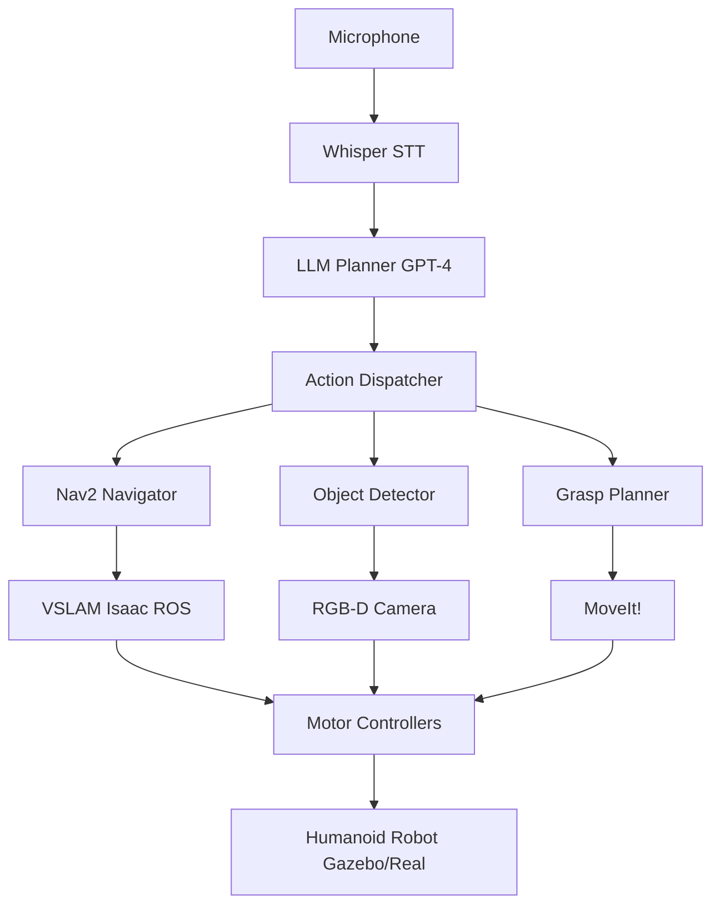

# Capstone: Autonomous Humanoid Project

## Project Overview

**Goal**: Build a voice-controlled humanoid robot that navigates environments, detects objects, and executes multi-step tasks—integrating all four modules.

**Example Mission**:

```
User: "Robot, go to the kitchen, find the red cup on the counter, and bring it to me."

Robot:
1. Voice recognition (Whisper)
2. Task planning (GPT-4)
3. Navigation (Nav2 + VSLAM)
4. Object detection (YOLOv8 + Isaac ROS)
5. Grasping (MoveIt!)
6. Return navigation
7. Confirmation ("Here is your cup")
```

---

## System Architecture



---

## Phase 1: Environment Setup

### **Gazebo World**

```xml title="capstone_world.sdf"
<world name="capstone">
  <include>
    <uri>model://ground_plane</uri>
  </include>

  <!-- Kitchen -->
  <model name="kitchen_counter">
    <pose>5 3 0.5 0 0 0</pose>
    <static>true</static>
    <link name="link">
      <collision name="collision">
        <geometry><box><size>2 1 1</size></box></geometry>
      </collision>
      <visual name="visual">
        <geometry><box><size>2 1 1</size></box></geometry>
        <material><ambient>0.8 0.6 0.4 1</ambient></material>
      </visual>
    </link>
  </model>

  <!-- Red cup (target object) -->
  <model name="red_cup">
    <pose>5.5 3.2 1.1 0 0 0</pose>
    <link name="link">
      <inertial><mass>0.2</mass></inertial>
      <collision name="collision">
        <geometry><cylinder><radius>0.04</radius><length>0.12</length></cylinder></geometry>
      </collision>
      <visual name="visual">
        <geometry><cylinder><radius>0.04</radius><length>0.12</length></cylinder></geometry>
        <material><ambient>1 0 0 1</ambient></material>  <!-- Red -->
      </visual>
    </link>
  </model>

  <!-- User location marker -->
  <model name="user_marker">
    <pose>0 0 0.1 0 0 0</pose>
    <static>true</static>
    <link name="link">
      <visual name="visual">
        <geometry><sphere><radius>0.3</radius></sphere></geometry>
        <material><ambient>0 1 0 1</ambient></material>  <!-- Green -->
      </visual>
    </link>
  </model>
</world>
```

---

## Phase 2: Integration Node

```python title="autonomous_humanoid.py" showLineNumbers
import rclpy
from rclpy.node import Node
from std_msgs.msg import String
from geometry_msgs.msg import PoseStamped
from sensor_msgs.msg import Image
from cv_bridge import CvBridge
import whisper
import sounddevice as sd
from openai import OpenAI
import json

class AutonomousHumanoid(Node):
    def __init__(self):
        super().__init__('autonomous_humanoid')

        # Voice recognition
        self.whisper_model = whisper.load_model("base")
        self.sample_rate = 16000

        # LLM planning
        self.openai_client = OpenAI()

        # ROS publishers
        self.nav_goal_pub = self.create_publisher(PoseStamped, '/goal_pose', 10)
        self.action_pub = self.create_publisher(String, '/robot_action', 10)

        # ROS subscribers
        self.create_subscription(Image, '/camera/rgb/image_raw', self.camera_callback, 10)
        self.bridge = CvBridge()

        # State
        self.current_plan = []
        self.detected_objects = []

        self.get_logger().info('Autonomous humanoid ready!')

    def listen_for_command(self):
        """Capture voice command"""
        self.get_logger().info('Listening...')
        audio = sd.rec(
            int(5 * self.sample_rate),
            samplerate=self.sample_rate,
            channels=1,
            dtype='float32'
        )
        sd.wait()

        result = self.whisper_model.transcribe(audio.flatten(), fp16=False)
        command = result['text'].strip()
        self.get_logger().info(f'Command: "{command}"')
        return command

    def plan_task(self, command):
        """Use LLM to generate plan"""
        system_prompt = """
You are a planner for a humanoid robot. Output JSON array of actions:
- {"action": "navigate", "location": "..."}
- {"action": "detect", "object": "..."}
- {"action": "grasp", "object": "..."}
- {"action": "speak", "message": "..."}
"""

        response = self.openai_client.chat.completions.create(
            model="gpt-4",
            messages=[
                {"role": "system", "content": system_prompt},
                {"role": "user", "content": command}
            ],
            temperature=0.0
        )

        plan_text = response.choices[0].message.content
        self.current_plan = json.loads(plan_text)
        self.get_logger().info(f'Generated plan: {self.current_plan}')

    def execute_plan(self):
        """Execute each step in the plan"""
        for step in self.current_plan:
            action = step.get('action')

            if action == 'navigate':
                self.navigate_to(step['location'])
            elif action == 'detect':
                self.detect_object(step['object'])
            elif action == 'grasp':
                self.grasp_object(step['object'])
            elif action == 'speak':
                self.speak(step['message'])

            # Wait for action to complete (simplified)
            import time
            time.sleep(2)

    def navigate_to(self, location):
        """Send navigation goal"""
        locations = {
            'kitchen': (5.0, 3.0),
            'user': (0.0, 0.0)
        }

        if location in locations:
            pose = PoseStamped()
            pose.header.frame_id = 'map'
            pose.header.stamp = self.get_clock().now().to_msg()
            pose.pose.position.x, pose.pose.position.y = locations[location]
            pose.pose.orientation.w = 1.0

            self.nav_goal_pub.publish(pose)
            self.get_logger().info(f'Navigating to {location}')

    def camera_callback(self, msg):
        """Process camera feed for object detection"""
        # Convert to OpenCV
        cv_image = self.bridge.imgmsg_to_cv2(msg, 'bgr8')

        # Placeholder: Run YOLOv8 or similar
        # self.detected_objects = run_object_detection(cv_image)

    def detect_object(self, object_name):
        """Detect specific object"""
        self.get_logger().info(f'Searching for {object_name}...')
        # In real implementation, scan environment until object found

    def grasp_object(self, object_name):
        """Grasp detected object"""
        action = String()
        action.data = f'grasp:{object_name}'
        self.action_pub.publish(action)
        self.get_logger().info(f'Grasping {object_name}')

    def speak(self, message):
        """Text-to-speech output"""
        self.get_logger().info(f'Speaking: "{message}"')
        # Implement TTS (e.g., pyttsx3, gTTS)

def main(args=None):
    rclpy.init(args=args)
    robot = AutonomousHumanoid()

    try:
        # Main loop
        while rclpy.ok():
            command = robot.listen_for_command()

            if "robot" in command.lower():
                robot.plan_task(command)
                robot.execute_plan()

    except KeyboardInterrupt:
        pass
    finally:
        robot.destroy_node()
        rclpy.shutdown()

if __name__ == '__main__':
    main()
```

---

## Phase 3: Testing & Evaluation

### **Success Metrics**

| Metric                           | Target    | Measurement                                       |
| -------------------------------- | --------- | ------------------------------------------------- |
| **Task Completion Rate**         | &gt;80%   | Successful end-to-end executions / Total attempts |
| **Command Recognition Accuracy** | &gt;90%   | Correctly transcribed commands / Total commands   |
| **Navigation Success**           | &gt;95%   | Reached target without collisions                 |
| **Object Detection Accuracy**    | &gt;85%   | Correctly identified objects / Total detections   |
| **Execution Time**               | &lt;3 min | Average time from command to completion           |

### **Test Scenarios**

1. **Simple Fetch**: "Bring me the red cup"
2. **Multi-Object**: "Bring me the cup and the bottle"
3. **Recovery**: Introduce obstacle mid-navigation
4. **Ambiguity**: "Bring me something to drink" (requires clarification)
5. **Failure Mode**: Place object out of reach, verify error handling

---

## Phase 4: Demo Video

Create a 2-3 minute demo video showing:

1. **Introduction**: Brief overview of system
2. **Voice Command**: User issues command
3. **Planning Visualization**: Show LLM-generated plan
4. **Execution**: Time-lapse of robot performing task
5. **Completion**: Robot returns object, speaks confirmation
6. **Code Walkthrough**: 30-second highlight of key components

---

## Deliverables

### **1. Source Code** (GitHub Repository)

```
autonomous-humanoid/
├── README.md                 # Setup instructions
├── launch/
│   └── capstone.launch.py   # Main launch file
├── config/
│   ├── nav2_params.yaml
│   └── sensors.yaml
├── src/
│   ├── autonomous_humanoid.py
│   ├── voice_capture.py
│   ├── llm_planner.py
│   └── grasp_controller.py
├── worlds/
│   └── capstone_world.sdf
├── urdf/
│   └── humanoid.urdf.xacro
└── tests/
    └── test_integration.py
```

### **2. Documentation**

- **Architecture Diagram**: Mermaid or draw.io
- **Setup Guide**: Step-by-step installation
- **API Documentation**: Function docstrings
- **Troubleshooting Guide**: Common issues and fixes

### **3. Demo Video**

- Upload to YouTube/Vimeo
- Include in README

### **4. Evaluation Report**

- Success metrics table
- Failure analysis
- Future improvements

---

## Grading Rubric (100 Points)

| Category           | Points | Criteria                                           |
| ------------------ | ------ | -------------------------------------------------- |
| **Functionality**  | 40     | System successfully completes 4/5 test scenarios   |
| **Code Quality**   | 20     | PEP8 compliance, modularity, comments              |
| **Integration**    | 15     | All modules (ROS 2, Gazebo, Isaac, VLA) integrated |
| **Documentation**  | 10     | README, architecture diagram, setup guide          |
| **Demo Video**     | 10     | Clear demonstration of end-to-end capability       |
| **Error Handling** | 5      | Graceful recovery from failures                    |

---

## Key Takeaways

✅ **System Integration**: Combining vision, language, and action into a cohesive system

✅ **Real-World Constraints**: Handling noise, latency, and uncertainties

✅ **Modularity**: Clean interfaces between components enable debugging

✅ **Evaluation**: Quantitative metrics validate system performance

---

## Congratulations!

You've completed the Physical AI & Humanoid Robotics course! You now have the skills to:

- Build ROS 2-based robotic systems
- Simulate in Gazebo and Isaac Sim
- Deploy AI perception on NVIDIA Jetson
- Create voice-controlled autonomous robots

**Next Steps**:

- Deploy to physical hardware
- Contribute to open-source robotics projects
- Join robotics competitions (RoboCup, DARPA Robotics Challenge)
- Explore research in embodied AI

[View all course assessments →](../supporting/assessments.mdx)

[Return to Homepage →](/)
