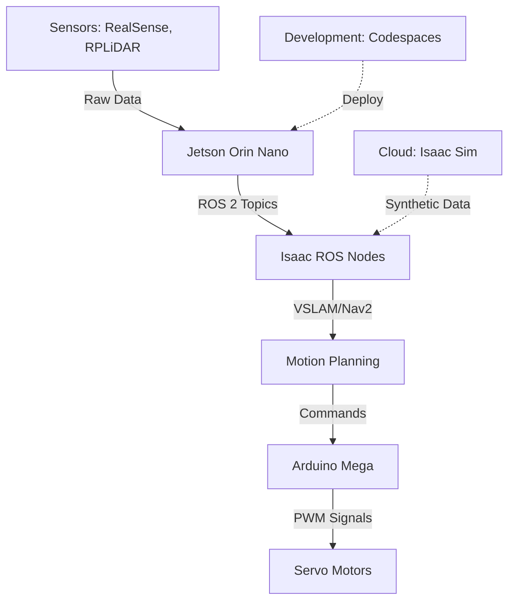

# Hardware Requirements

## Overview

This course can be completed using **physical hardware**, **cloud services**, or a **hybrid approach**. Choose the option that best fits your budget and learning style.

---

## Option 1: Physical Hardware Setup

**Total Cost**: ~$800-1200
**Best For**: Hands-on learners who want tactile experience with sensors and actuators

### Minimum Hardware

| Component                   | Specification                               | Purpose                            | Est. Cost | Vendor Links                                                                                   |
| --------------------------- | ------------------------------------------- | ---------------------------------- | --------- | ---------------------------------------------------------------------------------------------- |
| **NVIDIA Jetson Orin Nano** | 8GB RAM, 1024 CUDA cores                    | Edge AI inference for Isaac ROS    | $499      | [NVIDIA Store](https://www.nvidia.com/en-us/autonomous-machines/embedded-systems/jetson-orin/) |
| **Intel RealSense D435i**   | Depth camera + IMU, USB 3.0                 | Visual SLAM and obstacle detection | $279      | [Intel Store](https://www.intelrealsense.com/depth-camera-d435i/)                              |
| **RPLiDAR A1**              | 360° laser scanner, 12m range, USB          | 2D mapping and localization        | $99       | [Slamtec Store](https://www.slamtec.com/en/Lidar/A1)                                           |
| **Servo Motors (12x)**      | MG996R digital servos, 10kg-cm torque       | Humanoid joint actuation           | $120      | [Amazon](https://amazon.com)                                                                   |
| **Microcontroller**         | Arduino Mega 2560 or Raspberry Pi Pico      | Low-level servo control            | $40       | [Arduino Store](https://www.arduino.cc/)                                                       |
| **Power Supply**            | 12V 10A adapter + voltage regulator         | Power for servos and sensors       | $30       | Generic vendors                                                                                |
| **Cabling & Mounts**        | Jumper wires, breadboard, 3D-printed mounts | Assembly                           | $50       | Various                                                                                        |
| **SD Card**                 | 128GB UHS-I (for Jetson)                    | OS and storage                     | $20       | Generic vendors                                                                                |

**Total**: ~$1,137

### Optional Enhancements

| Component               | Purpose                          | Cost                  |
| ----------------------- | -------------------------------- | --------------------- | --- |
| **Additional Sensors**  | Ultrasonic (HC-SR04), GPS module | Redundancy            | $30 |
| **Gripper**             | 2-finger parallel gripper        | Object manipulation   | $80 |
| **3D Printer Filament** | PLA for custom parts             | Structural components | $25 |

---

## Option 2: Cloud-Based Setup (Free Tier)

**Total Cost**: $0/month (with free tier credits)
**Best For**: Learners without access to physical hardware or working remotely

### Cloud Services

| Service                    | Specification                     | Purpose                                  | Free Tier                               | Upgrade Cost          |
| -------------------------- | --------------------------------- | ---------------------------------------- | --------------------------------------- | --------------------- |
| **NVIDIA Omniverse Cloud** | Isaac Sim streaming, RTX GPU      | Simulation and synthetic data generation | 1 year free trial                       | $30/month after trial |
| **GitHub Codespaces**      | 4-core CPU, 8GB RAM, 32GB storage | ROS 2 development environment            | 60 hours/month free                     | $0.18/hour after      |
| **Google Colab Pro**       | T4 GPU, 12GB VRAM, 100GB storage  | Training vision models                   | Free tier (limited GPU hours)           | $10/month Pro         |
| **AWS EC2 (g4dn.xlarge)**  | 4 vCPU, 16GB RAM, NVIDIA T4 GPU   | Heavy simulation/training                | 750 hours/year free tier (new accounts) | $0.526/hour           |

**Total**: $0 for first year with free tiers

### Cloud Workflow

1. **Develop** on GitHub Codespaces (ROS 2 nodes, launch files)
2. **Simulate** in Isaac Sim on Omniverse Cloud (physics, sensors)
3. **Train** perception models on Google Colab (YOLOv8, segmentation)
4. **Deploy** to cloud VM for final integration testing

---

## Option 3: Hybrid Approach (Recommended)

**Total Cost**: ~$400
**Best For**: Most learners; balances hands-on experience with cost efficiency

### Core Physical Hardware

- **NVIDIA Jetson Orin Nano**: $499 (essential for learning edge deployment)
- **Intel RealSense D435i**: $279 (hands-on sensor experience)

**Subtotal**: $778

### Cloud Supplements

- **Isaac Sim** (Omniverse Cloud): Simulate complex environments without GPU
- **Gazebo Classic**: Run locally (no GPU required for simple scenes)

**Total**: ~$778 (one-time hardware cost)

### Compromise Strategy

- **Local development**: ROS 2 nodes, URDF modeling, simple Gazebo worlds
- **Cloud simulation**: Isaac Sim for photorealistic rendering and large-scale data generation
- **Physical deployment**: Test final system on Jetson + RealSense

---

## Software Requirements (All Free)

### Operating System

- **Ubuntu 22.04 LTS** (native installation or WSL2 on Windows)
- **Alternative**: Ubuntu 20.04 LTS (if hardware doesn't support 22.04)

### ROS 2

- **Distribution**: Humble Hawksbill (LTS until May 2027)
- **Installation**: Binary packages via apt (recommended) or source build

### Simulation

- **Gazebo**: Classic 11 or Gazebo Fortress (Ignition)
- **Isaac Sim**: 2023.1.1+ (NVIDIA Omniverse)
- **Unity**: 2022.3 LTS (optional, for high-fidelity visualization)

### AI/ML Tools

- **Python**: 3.10 or 3.11
- **PyTorch**: 2.0+ (with CUDA 11.8+ for GPU support)
- **OpenCV**: 4.8+
- **NumPy, SciPy, Matplotlib**

### Development Tools

- **Git**: Version control
- **Docker**: Containerization (optional but recommended)
- **VS Code**: IDE with ROS extension

---

## Architecture Summary

### System Diagram



### Data Flow

1. **Perception**: RealSense + LiDAR → Jetson → Isaac ROS (VSLAM, object detection)
2. **Planning**: Nav2 (global/local planners) → Footstep planner → Joint trajectories
3. **Control**: Arduino Mega receives joint commands → PWM to servos
4. **Feedback**: Servo encoders → Joint states published to ROS 2

---

## Detailed Component Specifications

### NVIDIA Jetson Orin Nano

**Why This Choice?**

- GPU acceleration for Isaac ROS (30 FPS VSLAM vs. 3 FPS on CPU)
- 1024 CUDA cores enable real-time perception
- Power-efficient (15W typical, up to 25W max)
- Compact form factor (70mm x 45mm)

**Setup**:

1. Flash JetPack 5.1+ (includes Ubuntu 20.04 + CUDA 11.4)
2. Install ROS 2 Humble from source (binary packages not available for ARM64)
3. Install Isaac ROS packages (pre-built for Jetson)

**Alternatives**:

- **Jetson Xavier NX** ($399, discontinued but available used)
- **Jetson AGX Orin** ($1,999, overkill for this course)
- **Raspberry Pi 4 (8GB)** ($75, CPU-only, slower but budget-friendly)

---

### Intel RealSense D435i

**Why This Choice?**

- **Stereo depth**: 1280x720 @ 30 FPS, range 0.1m-10m
- **RGB camera**: 1920x1080 @ 30 FPS
- **IMU**: BMI055 6-axis (accel + gyro) at 200 Hz
- **ROS 2 support**: Official `realsense2_camera` package

**Calibration**:

```bash
# Install RealSense SDK
sudo apt install ros-humble-realsense2-camera

# Launch camera
ros2 launch realsense2_camera rs_launch.py

# Verify topics
ros2 topic list | grep camera
# /camera/depth/image_rect_raw
# /camera/color/image_raw
# /camera/imu
```

**Alternatives**:

- **OAK-D** ($149, stereo + AI accelerator, smaller depth range)
- **Azure Kinect** ($399, higher quality but discontinued)
- **ZED 2i** ($449, better outdoor performance, larger FOV)

---

### RPLiDAR A1

**Why This Choice?**

- **360° coverage** in 12m range (indoor)
- **Sample rate**: 8000 samples/second
- **ROS 2 driver**: `rplidar_ros2` package available
- **Affordable**: Best cost/performance ratio

**Setup**:

```bash
# Install driver
sudo apt install ros-humble-rplidar-ros

# Grant USB permissions
sudo chmod 666 /dev/ttyUSB0

# Launch
ros2 launch rplidar_ros rplidar_a1_launch.py

# Visualize in RViz2
ros2 run rviz2 rviz2
# Add LaserScan display → Topic: /scan
```

**Alternatives**:

- **RPLIDAR A2** ($269, 16m range, faster)
- **YDLIDAR X4** ($99, similar specs to A1)
- **Simulated LiDAR**: Use Gazebo ray sensor (free)

---

## Budget Breakdown by Learning Goal

### Goal 1: Learn ROS 2 Only ($0)

- Use Gazebo simulation exclusively
- No physical hardware needed

### Goal 2: Learn Simulation + Deployment ($778)

- Jetson Orin Nano + RealSense D435i
- Deploy Isaac ROS VSLAM and Nav2

### Goal 3: Build Full Humanoid ($1,137+)

- Add LiDAR, servos, microcontroller
- Construct physical robot chassis

---

## Recommended Purchase Timeline

### Week 1-2

- **None**: Use simulation only

### Week 5 (Start Module 2)

- **Optional**: Order Jetson Orin Nano (long lead time)

### Week 8 (Start Module 3)

- **Recommended**: Have Jetson + RealSense for Isaac ROS labs

### Week 11 (Start Module 4)

- **Optional**: Add microphone for voice input ($15-30)

---

## Troubleshooting

### Issue: Jetson USB Ports Not Recognizing Devices

**Solution**:

```bash
# Check USB devices
lsusb

# Reinstall USB rules
sudo udevadm control --reload-rules
sudo udevadm trigger
```

### Issue: RealSense Driver Installation Fails

**Solution**:

```bash
# Install from source
git clone https://github.com/IntelRealSense/librealsense.git
cd librealsense
mkdir build && cd build
cmake ../ -DCMAKE_BUILD_TYPE=Release
make -j4
sudo make install
```

### Issue: Servo Motors Not Responding

**Solution**:

- Check power supply (servos need 6-12V, 2A+ current)
- Verify PWM signal (use oscilloscope or logic analyzer)
- Test servos individually with Arduino ServoTest sketch

---

## Safety Guidelines

⚠️ **Electrical Safety**:

- Always disconnect power before wiring changes
- Use fuses to protect circuits from overcurrent
- Keep liquids away from electronics

⚠️ **Mechanical Safety**:

- Servo motors can exert 10+ kg-cm torque (pinch hazard)
- Secure robot to prevent falling
- Test in open area away from fragile objects

⚠️ **Software Safety**:

- Implement emergency stop button (physical + software)
- Set joint limits in URDF to prevent self-collision
- Always test in simulation before physical deployment

---

[View weekly breakdown →](./weekly-breakdown.mdx)

[View all assessments →](./assessments.mdx)

[Return to Homepage →](/)
