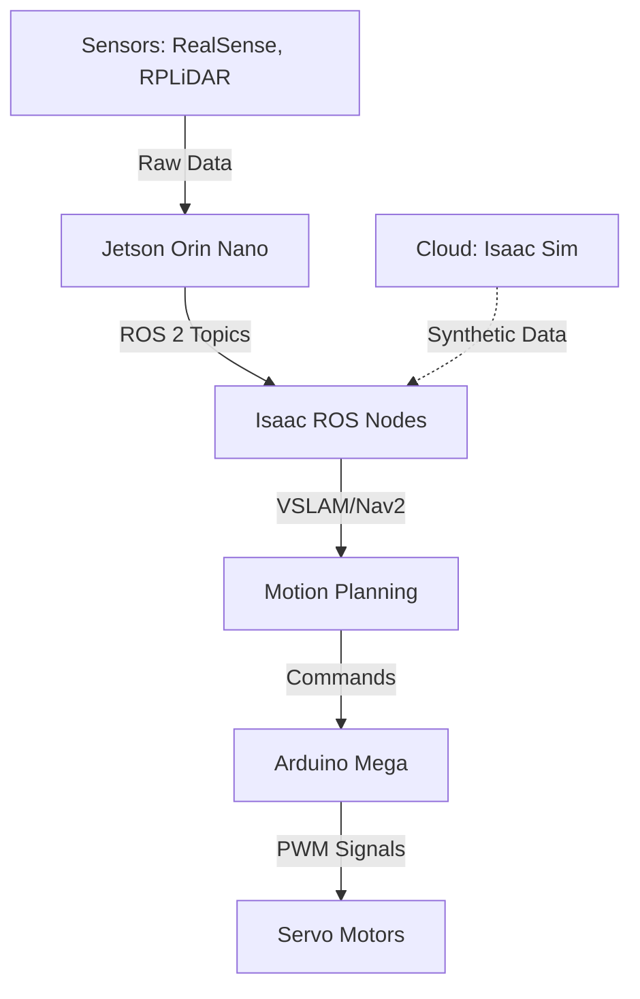
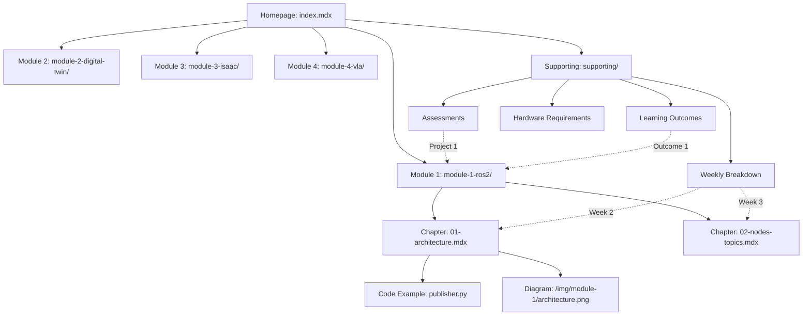

# Data Model: Physical AI & Humanoid Robotics Online Book

**Feature**: 002-docusaurus-book
**Created**: 2025-12-22
**Status**: Phase 1 - Data Model Defined

## Overview

This document defines the entity structures and content models for the Docusaurus-based educational book. All entities map to MDX files in the `docs/` directory, with metadata captured in frontmatter and content in Markdown/JSX body.

---

## Entity 1: Module

**Definition**: Represents a major course section covering a cohesive set of topics (e.g., "The Robotic Nervous System - ROS 2").

**Location**: `docs/module-{n}-{slug}/index.mdx`

**Attributes**:
```yaml
# Frontmatter (YAML)
---
id: module-1-ros2                    # Unique identifier (kebab-case)
title: "Module 1: The Robotic Nervous System"  # Display title
sidebar_label: "ROS 2 Basics"        # Short label for sidebar
sidebar_position: 2                  # Order in sidebar (1=intro, 2-5=modules, 6+=supporting)
description: "Learn the fundamentals of Robot Operating System 2 for humanoid robotics"
keywords: [ros2, robotics, middleware, nodes, topics, services, actions]
image: /img/module-1-hero.png        # Open Graph image
---

# Module 1: The Robotic Nervous System

## Overview
{1-2 paragraph introduction to module scope and learning objectives}

## What You'll Learn
- Learning objective 1
- Learning objective 2
- ...

## Topics Covered
1. [ROS 2 Architecture](./01-architecture.mdx)
2. [Nodes, Topics, Services, and Actions](./02-nodes-topics-services.mdx)
3. [rclpy Integration](./03-rclpy-integration.mdx)
4. [URDF for Humanoids](./04-urdf-humanoids.mdx)

## Prerequisites
- Python 3.8+ installed
- Basic Linux command-line knowledge
- (Optional) Prior robotics experience

## Estimated Time
6-8 hours over 2 weeks
```

**Relationships**:
- Contains 3-5 **Subsections/Chapters** (one-to-many)
- References 2-4 **Weekly Topics** (many-to-many via cross-links)

**Validation Rules**:
- `sidebar_position` must be unique within `docs/` directory
- `title` must match H1 heading in body
- `description` must be 120-160 characters (SEO optimization)
- All subsections must exist as files in same directory

**Example Usage**: Module 1 maps to `docs/module-1-ros2/index.mdx`

---

## Entity 2: Subsection/Chapter

**Definition**: Represents an individual learning unit within a module (e.g., "ROS 2 Architecture").

**Location**: `docs/module-{n}-{slug}/{nn}-{chapter-slug}.mdx`

**Attributes**:
```yaml
# Frontmatter (YAML)
---
id: ros2-architecture                # Unique identifier
title: "ROS 2 Architecture"          # Display title
sidebar_label: "Architecture"        # Short sidebar label
sidebar_position: 1                  # Order within module (1, 2, 3, ...)
description: "Explore the layered architecture of ROS 2 and its core components"
keywords: [ros2, architecture, dds, rmw, rclcpp, rclpy]
---

# ROS 2 Architecture

{Introduction paragraph}

## Core Concepts

### The DDS Middleware Layer
{Explanation with diagrams}

### ROS Client Libraries (rclcpp & rclpy)
{Code examples}

```python
import rclpy
from rclpy.node import Node

class MinimalPublisher(Node):
    def __init__(self):
        super().__init__('minimal_publisher')
        self.publisher_ = self.create_publisher(String, 'topic', 10)
```

## Key Takeaways
- Takeaway 1
- Takeaway 2

## Next Steps
Continue to [Nodes, Topics, Services](./02-nodes-topics-services.mdx) to learn about ROS 2 communication patterns.
```

**Relationships**:
- Belongs to one **Module** (many-to-one)
- Contains 3-10 **Code Examples** (one-to-many, inline)
- Contains 0-5 **Diagrams/Visuals** (one-to-many, inline)
- Cross-references other **Subsections** via hyperlinks

**Validation Rules**:
- `sidebar_position` must be unique within parent module directory
- File naming convention: `{nn}-{slug}.mdx` where `nn` is zero-padded number (01, 02, ...)
- Code blocks must specify language (```python, ```bash, ```yaml)
- All images must have alt text
- "Next Steps" section must link to logical next chapter or assessment

**Example Usage**: Chapter 1 of Module 1 maps to `docs/module-1-ros2/01-architecture.mdx`

---

## Entity 3: Code Example

**Definition**: Represents a syntax-highlighted code snippet with explanatory context.

**Location**: Inline within **Subsection/Chapter** MDX files, using fenced code blocks

**Attributes**:
```markdown
<!-- Context paragraph before code -->
Here's how to create a simple ROS 2 publisher node:

```python title="minimal_publisher.py" showLineNumbers
import rclpy
from rclpy.node import Node
from std_msgs.msg import String

class MinimalPublisher(Node):
    def __init__(self):
        super().__init__('minimal_publisher')
        self.publisher_ = self.create_publisher(String, 'topic', 10)
        self.timer = self.create_timer(0.5, self.timer_callback)
        self.i = 0

    def timer_callback(self):
        msg = String()
        msg.data = f'Hello World: {self.i}'
        self.publisher_.publish(msg)
        self.get_logger().info(f'Publishing: "{msg.data}"')
        self.i += 1

def main(args=None):
    rclpy.init(args=args)
    minimal_publisher = MinimalPublisher()
    rclpy.spin(minimal_publisher)
    minimal_publisher.destroy_node()
    rclpy.shutdown()

if __name__ == '__main__':
    main()
```

<!-- Explanation after code -->
This example creates a node that publishes a message every 0.5 seconds to the `topic` topic.
```

**Structure** (Docusaurus code block metadata):
- **Language Identifier**: `python`, `bash`, `yaml`, `xml`, `cpp`, `ros2` (custom if needed)
- **Title** (optional): `title="filename.ext"` displays filename above code block
- **Line Numbers** (optional): `showLineNumbers` adds line numbers
- **Highlighting** (optional): `{1-3,7}` highlights specific lines

**Validation Rules**:
- All code blocks MUST specify language (no ``` only)
- Python code must be valid syntax (linter check in Phase 6)
- ROS 2 code must use `rclpy` (Python) or `rclcpp` (C++) conventions
- Code length: 5-50 lines (if longer, link to GitHub gist)
- Context paragraphs: Before (what it does) + After (why it matters)

**Example Usage**: Embedded in `docs/module-1-ros2/03-rclpy-integration.mdx`

---

## Entity 4: Diagram/Visual

**Definition**: Represents educational imagery (diagrams, flowcharts, screenshots, illustrations).

**Location**:
- **Image Files**: `static/img/{module-slug}/{diagram-name}.png|svg`
- **References**: Inline in MDX via `` or `<Image />` component

**Attributes**:
```markdown
<!-- Standard Markdown image -->


<!-- Or Docusaurus Image component for advanced features -->
import Image from '@theme/IdealImage';

<Image
  img={require('/img/module-1-ros2/architecture-layers.png')}
  alt="ROS 2 Architecture Layers"
  caption="Figure 1.1: ROS 2 layered architecture with DDS middleware"
/>
```

**Metadata** (tracked in image filename and alt text):
- **Module Context**: Inferred from file path (`module-1-ros2/`, `module-2-digital-twin/`)
- **Alt Text**: Required, descriptive (not "image1.png"), 80-120 characters
- **Caption** (optional): Numbered figure reference (e.g., "Figure 2.3: ...")
- **Format**: PNG (photos/complex diagrams), SVG (simple diagrams/icons)
- **Size**: Max 200KB per image (optimize with tinypng.com or ImageOptim)

**Relationships**:
- Belongs to one **Subsection/Chapter** (many-to-one)
- May be referenced in multiple chapters (via URL reuse)

**Validation Rules**:
- Alt text MUST be present (accessibility requirement FR-015)
- Images MUST be in `static/img/` directory (not `docs/`)
- File naming: `{module-slug}/{descriptive-name}.{ext}` (kebab-case)
- SVG files must have `<title>` and `<desc>` tags for accessibility
- No copyrighted images without attribution (FR-019)

**Example Usage**: Diagram in `docs/module-2-digital-twin/01-gazebo-simulation.mdx` references `/img/module-2-digital-twin/gazebo-world-setup.png`

---

## Entity 5: Learning Outcome

**Definition**: Represents a measurable educational goal that learners will achieve upon course completion.

**Location**: `docs/supporting/learning-outcomes.mdx`

**Attributes**:
```markdown
---
id: learning-outcomes
title: "Learning Outcomes"
sidebar_label: "Outcomes"
sidebar_position: 10              # After modules, before weekly breakdown
description: "What you'll master in this Physical AI and Humanoid Robotics course"
---

# Learning Outcomes

By the end of this course, you will be able to:

## 1. Design and Deploy ROS 2 Systems
Build distributed robotic systems using ROS 2 nodes, topics, services, and actions for real-time control of humanoid robots.

**Assessments**: Project 1 (ROS 2 Architecture), Weekly Labs 1-3

---

## 2. Create Digital Twin Simulations
Develop high-fidelity physics simulations in Gazebo and Unity for sensor testing, motion planning, and visualization.

**Assessments**: Project 2 (Gazebo Humanoid Simulation), Weekly Labs 4-6

---

## 3. Integrate AI-Powered Navigation
Implement NVIDIA Isaac ROS modules for VSLAM, synthetic data generation, and bipedal navigation using Nav2.

**Assessments**: Project 3 (Isaac VSLAM Integration), Weekly Labs 7-10

---

## 4. Build Vision-Language-Action Systems
Combine voice input (Whisper), LLM reasoning (GPT-4), and robotic action execution for autonomous task planning.

**Assessments**: Capstone Project (Autonomous Humanoid), Weekly Labs 11-13

---

## 5. Optimize Robot Perception Systems
Configure and tune LiDAR, depth cameras, and IMU sensors for reliable environmental perception in dynamic settings.

**Assessments**: All hands-on labs, sensor calibration assignments

---

## 6. Deploy Production-Ready Robotics Software
Containerize, version, and deploy robotic applications using Docker, Git, and CI/CD best practices.

**Assessments**: Code reviews, deployment assignments, capstone submission
```

**Structure**:
- Numbered list (1-6) matching spec.md Key Entities
- Each outcome has:
  - **Title**: Action verb + skill area (e.g., "Design and Deploy...")
  - **Description**: 1-2 sentences explaining what learners will do
  - **Assessments**: Links to projects/labs that validate this outcome

**Validation Rules**:
- Total count: Exactly 6 outcomes (per spec.md)
- Each outcome must use action verb (Bloom's Taxonomy: Design, Create, Integrate, Build, Optimize, Deploy)
- Assessment links must point to valid pages (`assessments.mdx`, weekly breakdown)
- Outcomes must map to all 4 modules (no module left without outcome)

**Example Usage**: Entire content lives in `docs/supporting/learning-outcomes.mdx`

---

## Entity 6: Weekly Topic

**Definition**: Represents the course timeline structure, organizing content into 13-week progression.

**Location**: `docs/supporting/weekly-breakdown.mdx`

**Attributes**:
```markdown
---
id: weekly-breakdown
title: "Weekly Breakdown"
sidebar_label: "13-Week Schedule"
sidebar_position: 11
description: "Detailed week-by-week schedule for the Physical AI and Humanoid Robotics course"
---

# Weekly Breakdown

This course spans 13 weeks with ~6-8 hours of study time per week.

## Week 1: Introduction to Physical AI
**Module**: Introduction
**Topics**:
- What is Physical AI? Embodied intelligence vs. digital AI
- The humanoid robotics landscape (Boston Dynamics, Tesla Optimus, Figure)
- Course roadmap and learning objectives

**Deliverables**:
- Set up ROS 2 development environment
- Complete "Hello World" ROS 2 node

**Resources**:
- [Introduction to Physical AI](../introduction.mdx)
- [Learning Outcomes](./learning-outcomes.mdx)

---

## Week 2: ROS 2 Fundamentals
**Module**: [Module 1 - ROS 2](../module-1-ros2/index.mdx)
**Topics**:
- ROS 2 architecture and DDS middleware
- Nodes, topics, publishers, and subscribers
- ROS 2 command-line tools (ros2 node, ros2 topic, ros2 service)

**Deliverables**:
- Lab 1: Create a publisher-subscriber pair for sensor data
- Lab 2: Implement a simple ROS 2 service for robot control

**Resources**:
- [ROS 2 Architecture](../module-1-ros2/01-architecture.mdx)
- [Nodes and Topics](../module-1-ros2/02-nodes-topics-services.mdx)

---

{...Weeks 3-13 following same structure...}
```

**Structure**:
- 13 top-level sections (one per week)
- Each week has:
  - **Week Number and Title**: H2 heading
  - **Module**: Link to associated module (cross-reference)
  - **Topics**: Bulleted list of 3-5 topics covered
  - **Deliverables**: 1-3 labs/assignments due that week
  - **Resources**: Links to relevant chapters and external docs

**Relationships**:
- References **Modules** and **Subsections** (many-to-many via links)
- Aligns with **Assessments** (weekly labs mentioned here, detailed in assessments.mdx)

**Validation Rules**:
- Total count: Exactly 13 weeks (per spec.md requirements)
- Each week must link to at least one module chapter
- Deliverables must be testable/gradable (not vague like "Learn about...")
- Estimated time per week: 6-8 hours (stated in intro)

**Example Usage**: All weeks documented in single file `docs/supporting/weekly-breakdown.mdx`

---

## Entity 7: Assessment

**Definition**: Represents a project or evaluation with clear deliverables and grading criteria.

**Location**: `docs/supporting/assessments.mdx`

**Attributes**:
```markdown
---
id: assessments
title: "Assessments"
sidebar_label: "Projects & Labs"
sidebar_position: 12
description: "Hands-on projects and labs to validate your Physical AI and Humanoid Robotics skills"
---

# Assessments

## Grading Breakdown
- **Weekly Labs (40%)**: 13 labs × 3% each (drop lowest score)
- **Module Projects (40%)**: 4 projects × 10% each
- **Capstone Project (20%)**: Final autonomous humanoid demonstration

---

## Project 1: ROS 2 Humanoid Control System
**Module**: [Module 1 - ROS 2](../module-1-ros2/index.mdx)
**Due**: End of Week 4
**Weight**: 10%

### Objective
Design a distributed ROS 2 system to control a simulated humanoid robot's joint movements using publishers, subscribers, services, and actions.

### Deliverables
1. **Architecture Diagram**: ROS 2 node graph showing all nodes, topics, and services
2. **Source Code**: Python package with:
   - Joint state publisher node
   - Motion planning service
   - Emergency stop action server
3. **URDF Model**: Humanoid robot description with 20+ degrees of freedom
4. **Demo Video**: 2-minute screen recording of robot walking in Gazebo

### Evaluation Criteria
| Criterion | Points |
|-----------|--------|
| Code quality (PEP8, comments, modularity) | 30 |
| Functionality (all requirements met) | 40 |
| URDF accuracy (kinematics, visuals) | 20 |
| Documentation (README, inline docs) | 10 |
| **Total** | **100** |

### Resources
- [ROS 2 Architecture](../module-1-ros2/01-architecture.mdx)
- [URDF for Humanoids](../module-1-ros2/04-urdf-humanoids.mdx)

---

{...Projects 2-4 and Capstone following same structure...}

## Weekly Labs

### Lab 1: ROS 2 Publisher-Subscriber (Week 2)
Create a temperature sensor publisher and a monitor subscriber that logs data to a file.

**Submission**: GitHub repo link via learning management system

---

{...Labs 2-13 following same structure...}
```

**Structure**:
- **Grading Breakdown**: Percentage weights for all assessment types
- **Projects**: 4 major projects (one per module) with:
  - Objective (1-2 sentences)
  - Deliverables (numbered list, 3-5 items)
  - Evaluation Criteria (rubric table with point breakdown)
  - Resources (links to relevant chapters)
- **Weekly Labs**: 13 short labs with brief descriptions and submission instructions

**Validation Rules**:
- Total grading must sum to 100%
- Each project must link to its associated module
- Evaluation criteria must be measurable (no "good effort" - use point values)
- Deliverables must be concrete (code, diagrams, videos - not "understanding")

**Example Usage**: All assessments in single file `docs/supporting/assessments.mdx`

---

## Entity 8: Hardware Item

**Definition**: Represents a physical component or cloud alternative required for course labs.

**Location**: `docs/supporting/hardware-requirements.mdx`

**Attributes**:
```markdown
---
id: hardware-requirements
title: "Hardware Requirements"
sidebar_label: "Hardware"
sidebar_position: 13
description: "Physical hardware and cloud alternatives for the Physical AI and Humanoid Robotics course"
---

# Hardware Requirements

## Overview
This course can be completed using **physical hardware**, **cloud services**, or a **hybrid approach**.

---

## Option 1: Physical Hardware Setup
**Total Cost**: ~$800-1200
**Best For**: Hands-on learners who want tactile experience with sensors and actuators

### Minimum Hardware

| Component | Specification | Purpose | Est. Cost | Vendor Links |
|-----------|---------------|---------|-----------|--------------|
| **NVIDIA Jetson Orin Nano** | 8GB RAM, 1024 CUDA cores | Edge AI inference for Isaac ROS | $499 | [NVIDIA](https://www.nvidia.com/en-us/autonomous-machines/embedded-systems/jetson-orin/) |
| **RealSense D435i** | Depth camera + IMU | Visual SLAM and obstacle detection | $279 | [Intel](https://www.intelrealsense.com/depth-camera-d435i/) |
| **RPLiDAR A1** | 360° laser scanner, 12m range | 2D mapping and localization | $99 | [Slamtec](https://www.slamtec.com/en/Lidar/A1) |
| **Servo Motors (12x)** | MG996R digital servos | Humanoid joint actuation | $120 | [Amazon](https://amazon.com) |
| **Micro-controller** | Arduino Mega 2560 or Raspberry Pi Pico | Low-level servo control | $40 | [Arduino](https://www.arduino.cc/) |
| **Power Supply** | 12V 10A adapter | Power for servos and sensors | $30 | Generic |
| **Cabling & Mounts** | Jumper wires, breadboard, 3D-printed mounts | Assembly | $50 | Various |

**Total**: ~$1,117

---

## Option 2: Cloud-Based Setup (Free Tier)
**Total Cost**: $0/month (with free credits)
**Best For**: Learners without access to physical hardware or working remotely

### Cloud Services

| Service | Specification | Purpose | Free Tier | Upgrade Cost |
|---------|---------------|---------|-----------|--------------|
| **NVIDIA Omniverse Cloud** | Isaac Sim streaming | Simulation and synthetic data generation | 1 year free trial | $30/month after |
| **GitHub Codespaces** | 4-core, 8GB RAM | ROS 2 development environment | 60 hours/month free | $0.18/hour after |
| **Google Colab Pro** | T4 GPU, 12GB VRAM | Training vision models | Free tier (limited) | $10/month Pro |

**Total**: $0 for first year with free tiers

---

## Option 3: Hybrid Approach (Recommended)
**Total Cost**: ~$400
**Best For**: Most learners; balances hands-on experience with cost efficiency

- **Local Hardware**: Jetson Orin Nano ($499) + RealSense D435i ($279) = $778
- **Cloud Simulation**: Isaac Sim on Omniverse Cloud (free tier)
- **Compromise**: Simulate Gazebo environments locally, use cloud for Isaac Sim only

---

## Architecture Summary



---

## Software Requirements (All Free)
- **Operating System**: Ubuntu 22.04 LTS (for ROS 2 Humble)
- **ROS 2 Distribution**: Humble Hawksbill (LTS until 2027)
- **Python**: 3.10+
- **Isaac ROS**: 2.0+ (for NVIDIA hardware) or Isaac Sim (cloud)
- **Gazebo**: Classic 11 or Gazebo Fortress
- **Unity**: 2022.3 LTS (optional, for high-fidelity visualization)
```

**Structure**:
- Three hardware options (physical, cloud, hybrid) with cost breakdowns
- Tables with columns: Component, Specification, Purpose, Cost, Vendor Links
- Architecture diagram (Mermaid or image) showing how components connect
- Software requirements section

**Validation Rules**:
- All costs must be current (within $50 of actual prices as of 2025-12-22)
- Vendor links must be valid URLs (not placeholder text)
- Free tier limits must be accurate (e.g., NVIDIA Omniverse free for 1 year)
- FR-018 requirement: "structured tables with cost breakdowns and cloud alternatives" ✅

**Example Usage**: All hardware options in single file `docs/supporting/hardware-requirements.mdx`

---

## Content Relationships Diagram



---

## File Naming Conventions

| Entity | Pattern | Example |
|--------|---------|---------|
| Module index | `module-{n}-{slug}/index.mdx` | `module-1-ros2/index.mdx` |
| Chapter | `{nn}-{chapter-slug}.mdx` | `01-architecture.mdx` |
| Supporting section | `supporting/{name}.mdx` | `supporting/learning-outcomes.mdx` |
| Images | `img/{module-slug}/{name}.{ext}` | `img/module-1-ros2/architecture-layers.png` |
| Homepage | `index.mdx` | `docs/index.mdx` |

---

## Validation Checklist

Before content generation (Phase 2), verify:

- [ ] All entity types have examples in this document
- [ ] Frontmatter YAML is valid (no syntax errors, correct field names)
- [ ] Sidebar positions don't conflict (unique numbers within each directory)
- [ ] All internal links use relative paths (`../`, `./`)
- [ ] All images are in `static/img/` (not `docs/img/`)
- [ ] Code blocks specify language
- [ ] Alt text exists for all images
- [ ] Total file count estimate: 30-40 MDX files (matches spec.md)

---

## Next Steps

With data model defined, proceed to:

1. **Phase 1 Planning**: Create `contracts/sitemap.yaml` for URL mapping
2. **Phase 1 Planning**: Create `quickstart.md` for developer setup
3. **Phase 1 Execution**: Initialize Docusaurus project (T001-T006)
