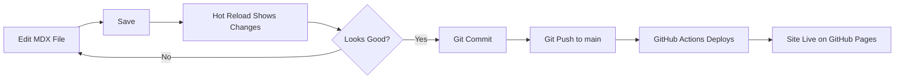

# Quickstart Guide: Physical AI & Humanoid Robotics Online Book

**Feature**: 002-docusaurus-book
**Created**: 2025-12-22
**For**: Developers setting up local development environment

---

## Prerequisites

Before you begin, ensure you have the following installed:

- **Node.js**: v18.0 or higher ([Download](https://nodejs.org/))
- **npm**: v8.0 or higher (comes with Node.js) or **yarn**: v1.22+
- **Git**: For version control ([Download](https://git-scm.com/))
- **Code Editor**: VS Code recommended ([Download](https://code.visualstudio.com/))

**Verify installations**:
```bash
node --version   # Should output v18.x.x or higher
npm --version    # Should output 8.x.x or higher
git --version    # Should output 2.x.x or higher
```

---

## Quick Setup (5 minutes)

### Step 1: Clone the Repository

```bash
git clone https://github.com/yourusername/physical-ai-humanoid-robotics-book.git
cd physical-ai-humanoid-robotics-book
```

### Step 2: Install Dependencies

```bash
npm install
# or if using yarn:
# yarn install
```

**What this does**: Installs Docusaurus, React, MDX, and all plugins defined in `package.json`.

### Step 3: Start Development Server

```bash
npm start
# or: yarn start
```

**What this does**:
- Starts local development server at `http://localhost:3000`
- Opens your default browser automatically
- Enables hot reload (changes appear instantly without refresh)

You should see the book homepage with navigation sidebar.

---

## Project Structure

```
physical-ai-humanoid-robotics-book/
├── docs/                          # All book content (MDX files)
│   ├── index.mdx                  # Homepage
│   ├── introduction.mdx           # Introduction to Physical AI
│   ├── module-1-ros2/             # Module 1: ROS 2
│   │   ├── index.mdx              # Module overview
│   │   ├── 01-architecture.mdx    # Chapter 1
│   │   ├── 02-nodes-topics-services.mdx
│   │   └── ...
│   ├── module-2-digital-twin/     # Module 2: Gazebo & Unity
│   ├── module-3-isaac/            # Module 3: NVIDIA Isaac
│   ├── module-4-vla/              # Module 4: VLA systems
│   └── supporting/                # Learning outcomes, assessments, etc.
├── static/                        # Static assets
│   └── img/                       # Images (diagrams, screenshots)
│       ├── module-1-ros2/
│       ├── module-2-digital-twin/
│       └── ...
├── src/                           # Custom React components and CSS
│   ├── css/
│   │   └── custom.css             # Theme customization (colors, fonts)
│   └── components/                # Reusable MDX components (optional)
├── docusaurus.config.js           # Docusaurus configuration
├── sidebars.js                    # Sidebar navigation structure
├── package.json                   # Dependencies and scripts
├── .github/
│   └── workflows/
│       └── deploy.yml             # GitHub Actions CI/CD
└── README.md                      # Project overview
```

---

## Common Development Tasks

### View the Site Locally

```bash
npm start
```

- **URL**: http://localhost:3000
- **Hot Reload**: Enabled (changes appear instantly)
- **Stop Server**: Press `Ctrl+C`

### Build for Production

```bash
npm run build
```

**What this does**:
- Generates static HTML/CSS/JS files in `build/` directory
- Optimizes assets (minification, code splitting)
- Validates all internal links
- Outputs bundle size report

**Build output**: `build/` directory (deployable to any static host)

### Test Production Build Locally

```bash
npm run serve
```

**What this does**:
- Serves the production build at `http://localhost:3000`
- Tests the site as it will appear on GitHub Pages
- Useful for final checks before deployment

### Clear Cache (If Hot Reload Breaks)

```bash
npm run clear
npm start
```

**Use when**: Docusaurus cache causes stale content or build errors.

---

## Editing Content

### Add a New Chapter

1. **Create MDX file** in appropriate module directory:
   ```
   docs/module-1-ros2/05-new-chapter.mdx
   ```

2. **Add frontmatter** at the top:
   ```mdx
   ---
   id: new-chapter
   title: "New Chapter Title"
   sidebar_label: "Short Label"
   sidebar_position: 5
   description: "Brief description for SEO"
   ---

   # New Chapter Title

   Your content here...
   ```

3. **Save** — hot reload shows changes instantly.

4. **Update sidebar** (if needed) in `sidebars.js`:
   ```js
   {
     type: 'category',
     label: 'Module 1: ROS 2',
     items: [
       'module-1-ros2/index',
       'module-1-ros2/01-architecture',
       // ...existing chapters...
       'module-1-ros2/05-new-chapter',  // Add here
     ],
   }
   ```

### Add Code Examples

Use fenced code blocks with language identifier:

````mdx
```python title="publisher.py" showLineNumbers
import rclpy
from rclpy.node import Node

class MinimalPublisher(Node):
    def __init__(self):
        super().__init__('minimal_publisher')
        self.publisher_ = self.create_publisher(String, 'topic', 10)
```
````

**Supported languages**: `python`, `bash`, `yaml`, `xml`, `cpp`, `javascript`, `typescript`

### Add Images

1. **Save image** in `static/img/{module-slug}/`:
   ```
   static/img/module-1-ros2/architecture-diagram.png
   ```

2. **Reference in MDX**:
   ```mdx
   
   ```

**Image requirements**:
- **Alt text**: Required for accessibility
- **Max size**: 200KB per image (optimize with [tinypng.com](https://tinypng.com/))
- **Formats**: PNG (photos), SVG (diagrams/icons)

### Customize Theme Colors

Edit `src/css/custom.css`:

```css
:root {
  --ifm-color-primary: #06B6D4;        /* Electric cyan */
  --ifm-color-primary-dark: #0891B2;
  --ifm-background-color: #1E3A8A;     /* Deep blue */
  --ifm-font-color-base: #F3F4F6;
}
```

Changes appear instantly with hot reload.

---

## Configuration Files

### `docusaurus.config.js` (Main Config)

**Key settings**:

```js
module.exports = {
  title: 'Physical AI & Humanoid Robotics',
  tagline: 'Embodied Intelligence: Bridging Digital AI and the Physical World',
  url: 'https://yourusername.github.io',
  baseUrl: '/physical-ai-humanoid-robotics-book/',
  organizationName: 'yourusername',     // GitHub username
  projectName: 'physical-ai-humanoid-robotics-book',  // Repo name

  themeConfig: {
    navbar: { /* ... */ },
    footer: { /* ... */ },
    prism: {
      theme: lightCodeTheme,
      darkTheme: darkCodeTheme,
      additionalLanguages: ['python', 'bash', 'yaml'],  // Add languages here
    },
  },
};
```

**When to edit**:
- Change site title/tagline
- Update GitHub repo URL for deployment
- Add syntax highlighting languages
- Configure search (Algolia or local plugin)

### `sidebars.js` (Navigation Structure)

**Auto-generated option** (recommended):

```js
module.exports = {
  tutorialSidebar: [
    {
      type: 'autogenerated',
      dirName: '.',  // Generate from docs/ directory structure
    },
  ],
};
```

**Manual option** (more control):

```js
module.exports = {
  tutorialSidebar: [
    'introduction',
    {
      type: 'category',
      label: 'Module 1: ROS 2',
      collapsed: false,  // Expanded by default
      items: [
        'module-1-ros2/index',
        'module-1-ros2/01-architecture',
        'module-1-ros2/02-nodes-topics-services',
      ],
    },
    // ...more modules...
  ],
};
```

**When to edit**:
- Reorganize navigation order
- Add/remove categories
- Control collapsed/expanded state

---

## Deployment

### Automatic Deployment (GitHub Actions)

**How it works**:
1. Push changes to `main` branch
2. GitHub Actions workflow (`.github/workflows/deploy.yml`) triggers automatically
3. Builds site with `npm run build`
4. Deploys to `gh-pages` branch
5. Site live at `https://yourusername.github.io/physical-ai-humanoid-robotics-book/`

**No manual steps required** — push to `main` is all you need.

### Manual Deployment (If Needed)

```bash
GIT_USER=yourusername npm run deploy
```

**What this does**:
- Builds site
- Pushes `build/` directory to `gh-pages` branch
- Triggers GitHub Pages deployment

**Use when**: Testing deployment or GitHub Actions is unavailable.

---

## Troubleshooting

### Port 3000 Already in Use

**Error**: `Something is already running on port 3000`

**Solution**:
```bash
# Kill process on port 3000 (Windows)
npx kill-port 3000

# Or specify different port
npm start -- --port 3001
```

### Broken Links Warning

**Error**: `Broken link on source page /module-1-ros2/architecture.mdx: the target link /nonexistent-page doesn't exist`

**Solution**:
- Fix the link path in the source MDX file
- Ensure the target file exists in `docs/`
- Use relative paths (`./`, `../`) for internal links

### Build Fails with "Out of Memory"

**Error**: `JavaScript heap out of memory`

**Solution**:
```bash
# Increase Node.js memory limit
NODE_OPTIONS=--max_old_space_size=4096 npm run build
```

### Hot Reload Not Working

**Solution**:
1. Stop server (`Ctrl+C`)
2. Clear cache: `npm run clear`
3. Restart: `npm start`

### Images Not Displaying

**Common mistakes**:
- ❌ `` — Wrong path (images must be in `static/`)
- ✅ `` — Correct (leading `/` references `static/`)

---

## Testing Checklist

Before deploying, verify:

- [ ] **Local build succeeds**: `npm run build` completes without errors
- [ ] **No broken links**: Build output shows zero broken link warnings
- [ ] **All images load**: Check every page for missing images
- [ ] **Code syntax highlighting works**: All code blocks have language specified
- [ ] **Responsive design**: Test on mobile (browser dev tools, F12 → Device Toolbar)
- [ ] **Dark mode works**: Toggle theme switch in top-right corner
- [ ] **Search works**: Try searching for technical terms (e.g., "ROS 2 nodes")
- [ ] **Accessibility**: Run WAVE checker (https://wave.webaim.org/)
- [ ] **Performance**: Lighthouse audit scores >90 (Chrome DevTools → Lighthouse)

---

## Useful Resources

- **Docusaurus Docs**: https://docusaurus.io/docs
- **MDX Syntax**: https://mdxjs.com/
- **Markdown Cheatsheet**: https://www.markdownguide.org/cheat-sheet/
- **Prism Language Support**: https://prismjs.com/#supported-languages
- **GitHub Pages Setup**: https://docs.github.com/en/pages

---

## Getting Help

- **Build errors**: Check terminal output for specific error messages
- **Styling issues**: Inspect element in browser (F12) to see applied CSS
- **Content questions**: Refer to `specs/002-docusaurus-book/spec.md` for requirements
- **Technical decisions**: See `specs/002-docusaurus-book/research.md`

---

## Development Workflow Summary



---

## Next Steps

1. **Read the spec**: `specs/002-docusaurus-book/spec.md` for project requirements
2. **Review data model**: `specs/002-docusaurus-book/data-model.md` for content structure
3. **Start creating content**: Begin with `docs/index.mdx` (homepage)
4. **Customize theme**: Edit `src/css/custom.css` for futuristic design
5. **Test locally**: Run `npm start` frequently to preview changes

Happy documenting! 🚀
